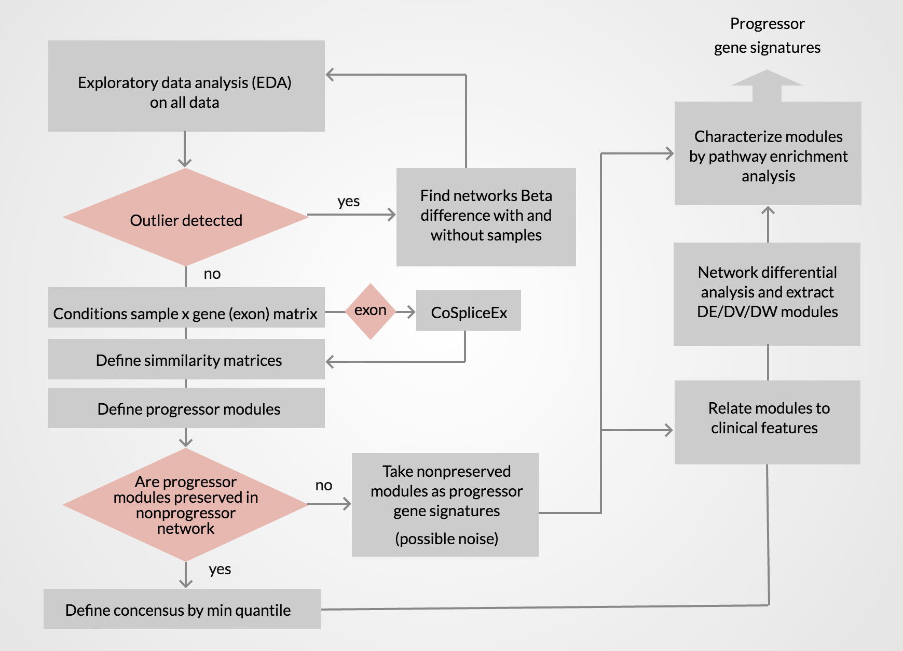

## Coexpression and CoSpliceEx weighted network analysis of Head and Neck Squamous Cell Carcinoma (HNSCC). 
We analyzed 229 patients’ samples from The Cancer Genome Atlas (TCGA) previously annotated by Bornstein et al (2016) on their progression status. 

## Publication 

##### ```Frontiers Genomics - Systems Biology: ORIGINAL RESEARCH ARTICLE```
##### doi: 10.3389/fgene.2018.00183
https://www.frontiersin.org/articles/10.3389/fgene.2018.00183

##### ```OHSU SCHOLAR ARCHIVE: Full Thesis Research```
##### doi:10.6083/M4WQ02WM
https://digitalcommons.ohsu.edu/etd/3824/

## Step-by-step study workflow for identification of progressor gene signatures 


## Dependencies 
R version 3.3.1 or 3.3.2 

## Credits
* Ovidiu Dan Iancu <a href="http://dx.doi.org/10.3389/fgene.2015.00174" target="_blank">open access research</a> and <a href="https://github.com/iancuo/cosplicingNetworks" target="_blank">code</a>
* <a href="https://horvath.genetics.ucla.edu/html/CoexpressionNetwork/Rpackages/WGCNA/" target="_blank">WGCNA</a>
* <a href="http://bmcgenomics.biomedcentral.com/articles/10.1186/s12864-015-2359-6" target="_blank">Bornstein et al. study (2016)</a>
* <a href="http://cancergenome.nih.gov/abouttcga" target="_blank">TCGA</a>
* Hadley Wickham <a href="http://hadley.nz/" target="_blank"> Data Science, Data import, and R software engineering libraries</a> 

## Note
This code was written over a short period of time to complete educational milestones and should not be taken as a computationally automated process/pipeline. However, each code segment (between code comments) may be repurposed. The publication requires this code to be public. 

